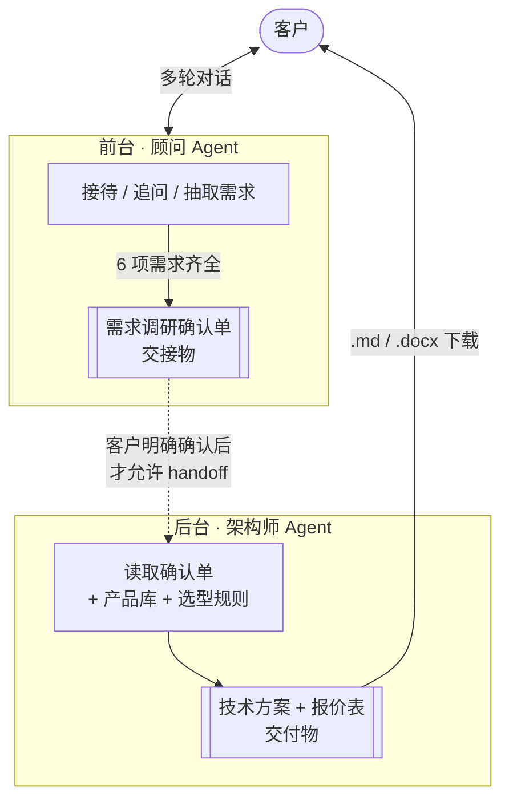
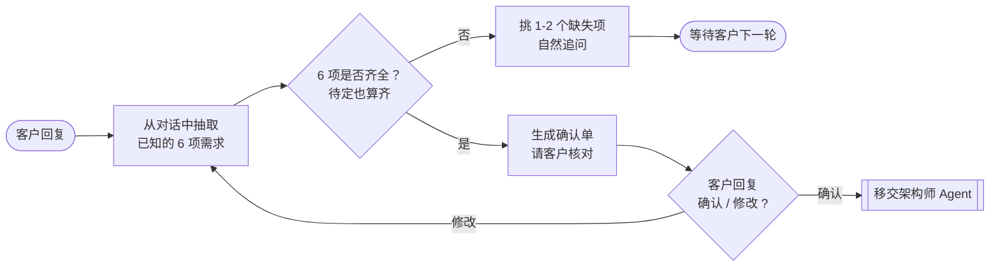
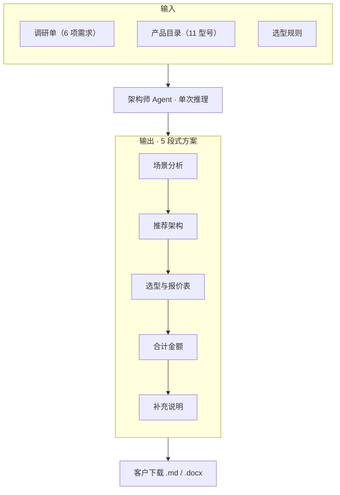
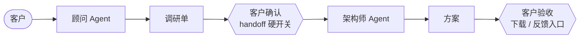

# AI 售前 Agent

> 一个面向 AI 视频分析业务的售前自动化工具。
> 把"资深售前 + 解决方案架构师"的两阶段工作方法沉淀成可对话的 AI 系统，
> 客户聊一次天，就能拿到一份《前期需求调研确认单》和《技术方案与商务报价》。

---

## 一、Agent 工作流程

系统由两个 Agent 协作完成：**顾问 Agent** 在前台与客户对话挖掘需求，
**架构师 Agent** 在后台基于产品库出方案。两者通过一份**《需求调研确认单》**
作为交接物完成 handoff，客户的"明确确认"是协作的硬性控制点。

### 1.1 两个 Agent 的协作方式



协作的关键约定有三条：

1. **职责互斥**：顾问只负责对话与需求结构化，**绝不输出方案**；架构师只接收结构化需求，**绝不与客户聊天**。
2. **交接物明确**：两者之间只通过一份 Markdown 调研单传递信息，避免上下文污染。
3. **控制点前置**：客户对调研单"明确确认"前，架构师不会被唤醒——这是避免 AI 越位拍方案的工程化保障。

### 1.2 阶段一：顾问 Agent 怎么和客户协作

顾问 Agent 与客户在多轮对话中循环，每一轮都做同样的三件事：



两个细节体现"售前感"：

- **循序渐进**：每轮只追问 1-2 个缺失项，不批量盘问
- **宽容机制**：客户说"不知道"就标"待定"继续推进，由架构师在补充说明里兜底建议

### 1.3 阶段二：架构师 Agent 怎么独立工作

架构师只被触发一次，输入输出都是结构化的：



架构师有几条**硬约束**写进了它的角色定义里，确保方案商务上不出错：

- 只能从产品目录里选型，不许编造
- 推理盒数量 ≥3 必须配管理终端（运维成本）
- 客户明确"数据不出厂"必须含训练机或推训一体方案（合规要求）
- 报价必须三段式：硬件 + 实施服务 + 可选增值服务

### 1.4 客户在协作中的角色

很多 AI agent 设计的通病是把客户当被动的提问对象。这里客户在协作中是**两个关键控制点**：



第一个控制点（确认调研单）保证了**方案不会建立在错误的需求上**；
第二个控制点（下载/反馈）保证了**方案是可带走的真实交付物**，而不是聊天记录。

---

## 二、Demo 实现说明

为了在面试作业的时间窗口内跑通完整链路，本 Demo 在以下两点上做了简化，
**真实落地时建议替换为对应的生产实现**：

### 2.1 调研维度与产品资料均为 mock

- **顾问 Agent 的 6 项调研维度**（行业 / 场景 / 点位数 / KPI / 环境 / 节拍）是
  我基于"AI 视频分析 + 工业 SOP 监测"场景**自行抽象**的最小必要信息集，
  并非来自客户真实售前 SOP 文档。
- **架构师 Agent 的产品目录**（`knowledge_base/products.json`，4 大类共 11 个型号、
  规格、单价）也都是按"边缘推理盒 / 训练机 / 管理终端 / 中心服务器（推训一体）"
  的产品形态**模拟**的，不代表真实产品参数与价格。

> 实际落地时，这两份资料应来自：售前团队沉淀的需求模板 + 产品部维护的官方报价手册。
> 替换数据源即可，**Agent 协作骨架与 prompt 框架无需变动**。

### 2.2 知识库直接注入，没有做 RAG 检索

当前架构师 Agent 是把整个 `products.json` 一次性拼到 prompt 里，
依赖 LLM 自己从中挑选合适的型号。这种实现的优缺点：

| 维度 | 当前 demo | 真实落地建议 |
|------|---------|------------|
| 产品规模 | < 20 个 SKU，全量注入没问题 | 数百型号 + 配件 + 多年报价历史，必须用 RAG |
| 准确性 | LLM 偶尔会算错小计或漏掉硬约束 | 选型用代码，文案用 LLM；或检索 + reranker 收敛候选 |
| 可维护性 | 改产品要发版 | KB 独立维护，Agent 只读 |
| 历史方案复用 | 无 | 检索历史相似项目，提升报价合理性 |

后续若产品 SKU 规模扩大，建议引入向量检索（如 Milvus / pgvector + bge-m3 embedding）+
**确定性的报价计算函数**作为 LLM 推理的兜底，把"算账"和"选型"从 LLM 责任里剥离出来。

---

## 三、交付物示例

完整跑完一次对话后，客户拿到的是：

### ① 前期需求调研确认单（阶段一产出）

```markdown
## 前期需求调研确认单

| 维度 | 客户确认内容 |
|------|------------|
| 所属行业 | 笔记本电脑组装（制造业）|
| 核心场景 | 装配 SOP 动作错漏检测 |
| 监控点位数 | 20 路 |
| 预期指标 | 准确率 ≥ 95%，漏报率 ≤ 3% |
| 物理与IT环境 | 工厂内光照稳定，有线网络，机架空间充足 |
| 业务节拍 | 每工位操作周期约 30s，延迟容忍 ≤ 2s |
```

### ② 技术方案 + 报价表（阶段二产出）

```markdown
# 技术架构选型方案

## 一、场景分析
客户为笔记本组装厂，20 路工位监控，需实时检测 SOP 动作错漏…

## 二、推荐架构
边缘推理为主：每 8 路部署 1 台推理盒…

## 三、产品选型与报价

| 产品型号 | 用途 | 数量 | 单价（万元） | 小计（万元） |
|---------|------|------|------------|------------|
| EdgeBox-M | 视频推理 | 3 台 | 3.8 | 11.4 |
| EdgeManager-20 | 集中管理 | 1 台 | 2.5 | 2.5 |
| 标准实施服务 | 部署调试+培训 | 1 项 | 2.0 | 2.0 |
| **合计** | | | | **15.9 万元** |

## 四、补充说明
…
```

支持一键导出为 **Markdown** 或 **Word（.docx）** 文档，可直接发给客户。

---

## 四、产品知识库

`knowledge_base/products.json` 覆盖了完整的四件套产品线：

| 类别 | 型号数 | 覆盖场景 |
|------|-------|---------|
| 边缘推理盒（EdgeBox） | 3 个（S/M/L） | 1-16 路边缘推理 |
| 训练机（TrainBox） | 2 个（Pro/Ultra） | 现场模型迭代 |
| 推理盒管理终端（EdgeManager） | 2 个（20/100） | 多节点集中运维 |
| 中心服务器推训一体（CenterServer） | 2 个（32/64） | 大规模集中部署 |
| 实施与服务（Service） | 4 项 | 部署、定制、运维 |

每个型号都包含规格、适用场景、单价，确保架构师阶段输出的报价**有据可查**。

---

## 五、项目结构

```
presales_agent_demo/
├── app.py                          # Streamlit 入口（含侧边栏 + 下载按钮）
├── design-document.md              # 设计文档（详细架构）
├── PRD.md                          # 业务需求说明书
├── test.md                         # 6 个测试场景脚本
├── knowledge_base/
│   ├── products.json               # 产品目录
│   └── pricing_rules.md            # 选型规则
└── agent/
    ├── states.py                   # 共享状态定义
    ├── llm.py                      # LLM 客户端封装
    ├── exporters.py                # Markdown → Word 转换器
    ├── graph.py                    # 流程编排
    └── nodes/
        ├── consultant.py           # 阶段一：顾问节点
        └── architect.py            # 阶段二：架构师节点
```

---

## 六、快速启动

```bash
# 1. 创建并激活 conda 环境（推荐 Python 3.11）
conda create -n presales_agent python=3.11 -y
conda activate presales_agent

# 2. 安装依赖
pip install -r requirements.txt

# 3. 配置 LLM（兼容 OpenAI / DeepSeek / 通义千问 / 智谱等）
cp .env.example .env
# 编辑 .env 填入：
#   LLM_API_KEY=你的key
#   LLM_BASE_URL=对应服务的endpoint
#   LLM_MODEL=对应模型名

# 4. 启动
streamlit run app.py
```

浏览器访问 <http://localhost:8501>，AI 顾问会主动开始对话。

### LLM 接入示例

```dotenv
# OpenAI 官方
LLM_API_KEY=sk-xxx
LLM_BASE_URL=
LLM_MODEL=gpt-4o-mini

# 通义千问（国内访问稳定）
LLM_API_KEY=sk-xxx
LLM_BASE_URL=https://dashscope.aliyuncs.com/compatible-mode/v1
LLM_MODEL=qwen-plus

# DeepSeek
LLM_API_KEY=sk-xxx
LLM_BASE_URL=https://api.deepseek.com/v1
LLM_MODEL=deepseek-chat
```

---

## 七、演示步骤（5 分钟跑通）

1. 启动后，AI 顾问会主动打招呼并提问
2. 按 [`test.md`](./test.md) 里的"场景一"逐条复制客户回复，模拟笔记本组装厂客户
3. 6 个维度收集齐后，AI 输出 Markdown 调研单
4. 回复"确认"，AI 自动跳转架构师阶段，输出完整方案与报价
5. 左侧栏点击「下载 Word」拿到可发给客户的方案文档


---

## 八、技术栈

- **Streamlit**：前端界面
- **LangGraph**：两阶段流程编排，agent实现
- **OpenAI 兼容 SDK**：LLM 调用层（可灵活切换底层模型）
- **python-docx**：Word 文档导出

