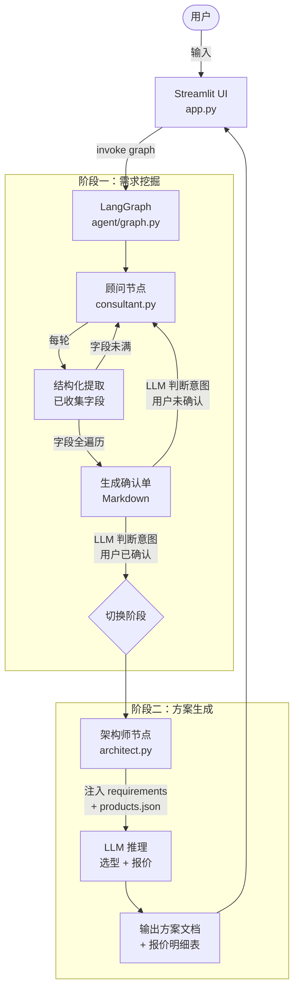

# 售前 Agent 产品设计文档（Design Document）

> 版本：v1.0 | 日期：2026-04-23

---

## 1. 项目背景与目标

本项目为面试作业交付物，模拟"AI 视觉售前架构师"的真实工作流。系统以对话形式与客户交互，自动完成需求挖掘、需求确认、方案输出、商务报价四个环节，无需人工介入。

**目标用户**：AI 视频分析产品的潜在客户（制造业、安防等领域）

**核心价值**：将原本需要资深售前工程师完成的 2-3 次现场调研压缩为一次 AI 对话。

---

## 2. 技术选型

| 层次 | 技术 | 选型理由 |
|------|------|---------|
| LLM | 兼容 OpenAI SDK 的任意接口（OpenAI / DeepSeek 等） | 通过环境变量 `LLM_BASE_URL` / `LLM_API_KEY` / `LLM_MODEL` 配置，灵活切换 |
| Agent 编排 | LangGraph | 有向图建模两阶段流转，状态可追溯，适合展示工程化能力 |
| UI | Streamlit | 快速可演示，内置 session_state 持久化对话 |
| 知识库 | JSON 文件（直接注入 prompt） | 无需向量数据库，规模小，全量注入即可 |

---

## 3. 系统架构



---

## 4. 状态模型（`agent/states.py`）

```python
class RequirementsDict(TypedDict, total=False):
    industry: str       # 所属行业
    scenarios: str      # 核心场景（痛点描述）
    camera_count: str   # 监控点位数（数值或"待定"）
    kpi: str            # 预期指标（准确率/漏报率）
    environment: str    # 物理与IT环境
    cycle_time: str     # 业务节拍/最大容忍延迟

class PresalesState(TypedDict):
    phase: str              # "consulting" | "confirmed" | "done"
    messages: list          # LangGraph Messages 格式的对话历史
    requirements: RequirementsDict
    confirmation_doc: str   # 阶段一产出的 Markdown 确认单
    solution: str           # 阶段二产出的完整方案文本
```

**phase 流转规则：**

| 当前 phase | 触发条件 | 下一 phase |
|-----------|---------|-----------|
| `consulting` | 6 个字段全部有值或标记"待定" | `confirmed` |
| `confirmed` | LLM 判断用户意图为确认 | `done` |
| `done` | — | 进入架构师节点，不再循环 |

---

## 5. 阶段一：顾问节点（`agent/nodes/consultant.py`）

### 5.1 角色 Prompt 框架

```
你是一名专业的 AI 视觉售前顾问。你的任务是通过多轮对话，
收集客户在以下 6 个维度的信息：
  1. 所属行业
  2. 核心场景（具体痛点）
  3. 监控点位数
  4. 预期准确率/漏报率指标
  5. 物理与IT环境（光照、网络、空间）
  6. 业务节拍（产线速度/最大容忍延迟）

沟通原则：
- 每次只提问 1-2 个缺失维度，不要长篇盘问
- 若客户明确表示"不知道/待定"，标记为"待定"并继续推进
- 保持专业且亲切的沟通风格
```

### 5.2 字段提取策略

每轮对话结束后，调用一次 LLM 的 Structured Output（`response_format` 指定 JSON Schema），从完整对话历史中提取已知字段，写入 `state["requirements"]`。

### 5.3 确认单生成

当所有字段均有值或为"待定"时，LLM 生成如下格式的确认单并输出给用户：

```markdown
## 前期需求调研确认单

| 维度 | 客户确认内容 |
|------|------------|
| 所属行业 | 笔记本电脑组装（制造业）|
| 核心场景 | 装配 SOP 动作错漏检测 |
| 监控点位数 | 20 路 |
| 预期指标 | 准确率 ≥ 95%，漏报率 ≤ 3% |
| 物理与IT环境 | 工厂内光照稳定，有线网络，机架空间充足 |
| 业务节拍 | 每工位操作周期约 30s，延迟容忍 ≤ 2s |

请确认以上信息是否准确，确认后我将为您生成技术方案与报价。
```

### 5.4 确认意图识别

收到用户回复后，调用 LLM 判断意图：
- 返回 `{"confirmed": true}` → `phase = "done"`，触发路由跳转至架构师节点
- 返回 `{"confirmed": false, "correction": "..."}` → 更新对应字段，重新生成确认单

---

## 6. 阶段二：架构师节点（`agent/nodes/architect.py`）

### 6.1 工作方式

不与用户进行多轮交互，**一次性**完成推理和输出。

输入：
- `state["requirements"]`（JSON 字符串）
- `knowledge_base/products.json` 全量内容（注入 prompt）

### 6.2 角色 Prompt 框架

```
你是一名资深的 AI 视觉解决方案架构师。
根据以下客户需求和产品目录，输出完整的技术方案与报价。

【客户需求】
{requirements_json}

【产品目录】
{products_json}

请按以下结构输出：
1. 场景分析（简述客户核心痛点与部署逻辑）
2. 推荐架构（说明边缘/中心的选型依据）
3. 产品选型清单（Markdown 表格，含型号/数量/单价/小计）
4. 项目总价
5. 补充说明（待定项的处理建议）
```

### 6.3 输出格式示例

```markdown
## 技术架构选型方案

### 场景分析
客户为笔记本组装厂，20 路工位监控，需实时检测 SOP 动作错漏，
延迟要求严格（≤2s），适合边缘推理分布式部署。

### 推荐架构
边缘推理为主：每 4 路部署 1 台推理盒，统一接入管理终端进行监控与模型升级。

### 产品选型与报价

| 产品型号 | 用途 | 数量 | 单价（万元） | 小计（万元） |
|---------|------|------|------------|------------|
| EdgeBox-M | 视频推理（8路/台） | 3 台 | 3.8 | 11.4 |
| EdgeManager-20 | 集中管理 20 路 | 1 台 | 2.5 | 2.5 |
| 实施服务费 | 部署调试+培训 | 1 项 | 2.0 | 2.0 |
| **合计** | | | | **15.9 万元** |

### 补充说明
- 若客户后续需现场模型迭代，可增配 TrainBox-Pro（约 8 万/台）
- 网络环境标记为待定，建议现场勘查后确认交换机带宽是否满足要求
```

---

## 7. 产品知识库 Mock（`knowledge_base/products.json`）

### 7.1 边缘推理盒（EdgeBox 系列）

| 型号 | 最大通道数 | 算力 | 功耗 | 尺寸 | 适用场景 | 单价（万元） |
|------|-----------|------|------|------|---------|------------|
| EdgeBox-S | 4 路 | 4 TOPS | 15W | 迷你主机 | 小型工位，1-4 路 | 1.8 |
| EdgeBox-M | 8 路 | 16 TOPS | 60W | 1U 机架 | 中型产线，5-8 路 | 3.8 |
| EdgeBox-L | 16 路 | 40 TOPS | 150W | 2U 机架 | 大型车间，9-16 路 | 7.2 |

### 7.2 训练机（TrainBox 系列）

| 型号 | GPU | 显存 | 适用 | 单价（万元） |
|------|-----|------|------|------------|
| TrainBox-Pro | RTX 4090 × 2 | 48GB | 现场模型迭代、小批量训练 | 8.0 |
| TrainBox-Ultra | A100 × 2 | 160GB | 大规模多场景训练 | 28.0 |

### 7.3 推理盒管理终端（EdgeManager 系列）

| 型号 | 最大管理节点 | 功能 | 单价（万元） |
|------|-----------|------|------------|
| EdgeManager-20 | 20 台推理盒 | 统一监控 / 固件升级 / 告警 | 2.5 |
| EdgeManager-100 | 100 台推理盒 | 含多租户 / 权限管理 / 审计日志 | 6.0 |

### 7.4 中心服务器——推训一体（CenterServer 系列）

| 型号 | 推理通道 | GPU | 适用规模 | 单价（万元） |
|------|---------|-----|---------|------------|
| CenterServer-32 | 32 路 | A30 × 4 | 中大型工厂集中部署 | 18.0 |
| CenterServer-64 | 64 路 | A100 × 4 | 大型工厂或多厂区统一管理 | 42.0 |

---

## 8. LangGraph 图定义（`agent/graph.py`）

```python
from langgraph.graph import StateGraph, END
from agent.states import PresalesState
from agent.nodes.consultant import consultant_node
from agent.nodes.architect import architect_node

def routing(state: PresalesState) -> str:
    if state["phase"] == "done":
        return "architect"
    return "consultant"

graph = StateGraph(PresalesState)
graph.add_node("consultant", consultant_node)
graph.add_node("architect", architect_node)
graph.set_entry_point("consultant")
graph.add_conditional_edges("consultant", routing)
graph.add_edge("architect", END)

compiled_graph = graph.compile()
```

---

## 9. Streamlit UI（`app.py`）

### 9.1 核心逻辑

```python
from uuid import uuid4
import streamlit as st
from agent.graph import compiled_graph

# 初始化 session
if "thread_id" not in st.session_state:
    st.session_state.thread_id = str(uuid4())
    st.session_state.display_messages = []

# 渲染历史消息
for msg in st.session_state.display_messages:
    with st.chat_message(msg["role"]):
        st.markdown(msg["content"])

# 用户输入
if user_input := st.chat_input("请描述您的需求..."):
    st.session_state.display_messages.append({"role": "user", "content": user_input})
    with st.chat_message("user"):
        st.markdown(user_input)

    result = compiled_graph.invoke(
        {"messages": [("human", user_input)]},
        config={"configurable": {"thread_id": st.session_state.thread_id}}
    )

    ai_reply = result["messages"][-1].content
    st.session_state.display_messages.append({"role": "assistant", "content": ai_reply})
    with st.chat_message("assistant"):
        st.markdown(ai_reply)
```

### 9.2 分阶段渲染策略

| 当前阶段 | 渲染方式 |
|---------|---------|
| `consulting` | 普通聊天气泡（`st.chat_message`） |
| `confirmed`（展示确认单） | `st.chat_message` + `st.markdown` 渲染 Markdown 表格 |
| `done`（方案输出） | `st.success` 提示切换，`st.markdown` 渲染完整方案与报价表 |

---

## 10. 目录结构

```
presales_agent_demo/
├── app.py                          # Streamlit 入口
├── requirements.txt                # 依赖锁定
├── .env.example                    # 环境变量模板
├── knowledge_base/
│   ├── products.json               # Mock 产品目录（规格 + 定价）
│   └── pricing_rules.md            # 报价逻辑说明（注入 architect prompt）
└── agent/
    ├── __init__.py
    ├── states.py                   # PresalesState TypedDict
    ├── graph.py                    # LangGraph 图定义与路由
    └── nodes/
        ├── __init__.py
        ├── consultant.py           # 阶段一：需求挖掘节点
        └── architect.py            # 阶段二：方案生成节点
```

---

## 11. 环境变量配置（`.env.example`）

```env
LLM_BASE_URL=https://api.openai.com/v1   # 替换为 DeepSeek 等兼容接口
LLM_API_KEY=sk-xxxx
LLM_MODEL=gpt-4o                          # 或 deepseek-chat
```

---

## 12. 开发里程碑

| 序号 | 任务 | 预计时长 |
|------|------|---------|
| 1 | `products.json` + `states.py` 基础骨架 | 30 min |
| 2 | `consultant.py` + 基础 Streamlit 跑通对话 | 2 h |
| 3 | `architect.py` 方案与报价生成 | 1 h |
| 4 | `graph.py` 路由逻辑完善与端到端测试 | 1 h |
| 5 | UI 美化与边界场景测试 | 1 h |
| **合计** | | **~5.5 h** |
